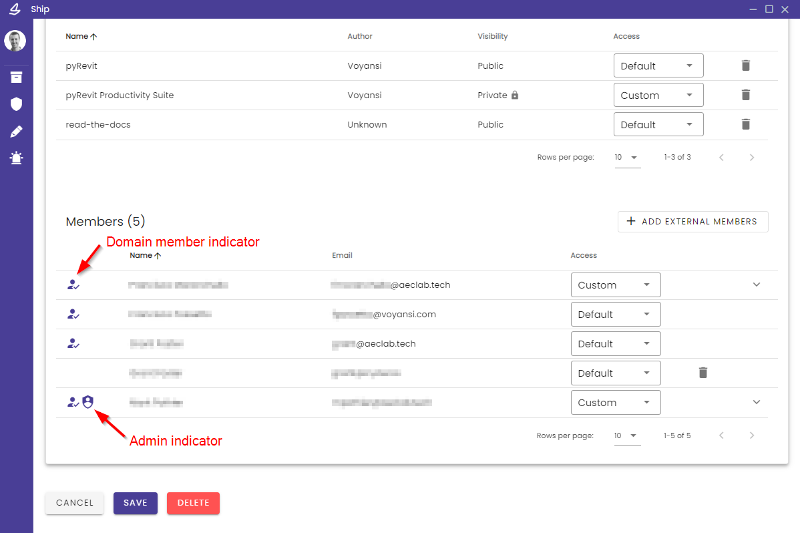

[Go to Main Page](README.md)

# Enterprise

_Guide for enterprise users, managers, and developers_

Ship's newest feature, Enterprise, gives organizations and developers a platform to come together to manage the distribution and access to private packages. Create collections of public and private packages for teams!

**_\*\* This feature is currently in beta; contact a Ship administrator to inquire about setting up an Enterprise account for your organization._**

## Create an Enterprise

In the Admin window, expand the `Enterprises` window, and click "Create Enterprise".

Fill out information describing the organization and its members (you will be able to edit this later as well):

- `Enterprise Name`: the display name used to identify the organization
- `Member Domains`: one or more email domains that will define the default members of the organization and their access to the Enterprise's private package subscriptions; Ship users must sign in with a provider that includes an email address (i.e. Google, email/password) in order for Ship to determine that their email domain matches an Enterprise's domain.
- `Packages` (optional): select any number of Public packages to include in an Enterprise's package collection; [Private package subscriptions can be added later](#private-packages)
- `External member emails` (optional): individual email address of members that don't have an approved member domain (e.g. consultants, guests)
- `Image URL` (optinal): URL address of an image; if included, will be used in the Browse listings UI to identify the Enterprise package collection

## Manage an Enterprise

_\*\* Enterprise administrators are currently designated by Ship admins. Contact a Ship admin to add or remove admins for a given Enterprise._

In the Admin window, Enterprise admins will see an "Enterprises" panel with a list of Enterprises in which they have admin management acess.

Under `Listing Data`, edit the Enterprise display name or logo image URL.

Under `Configuration`, you can manage the membership criteria and package collection.

#### Members

The `Members` table will automatically include any Ship users whose email address domain is included in the Enterprise's configured **member domains**; these domain members cannot be individually removed.

Explicitly-added external (non-domain) email address appear as well, and can be removed; use the "Add External Members" button to add new non-domain emails

#### Packages

_Jump to [Private Packages](#private-packages) to learn how to add them_

The `Packages` table includes a list of all public and private packages that have been added to the Enterprise collection. Use the "Add Public Packages" button to search for and add any publicly-available package to the collection. Packages can be removed at any time.

#### Member-Package Access

The Packages and Members tables both have an `Access` column, together determining which packages will be available (i.e. visible) to each member from the Enterprise collection in their Browse view. The settings and effects are as follows:

- Package > **Default**: package will be visible to all members
- Package > **Custom**: package will only be visible to members whose Access is also set to Custom, and for whom the package is specifically enabled; note that any package, Public or Private, can be set to Custom access
- Member > **Default**: member will see only the packages for which the Access setting is set to Default
- Member > **Custom**: member will see all Default packages, plus any Custom packages specifically enabled in the member dropdown (toggle switch must be switched on)

These settings allow for customized "sub-collections" that can be targeted to specific individuals within an Enterprise organization. This can be helpful when certain tools or packages, especially private ones, should be restricted in use to a smaller subset of the organization.

## Private Packages

Private packages can be added to an Enterprise through a request/approval process between an Enterprise and a package Author. This is to ensure that both parties retain control over which information is shared and with whom.

_\*\* Currently, this process assumes that there is an existing line of communication between Enterprise and package Author (e.g. a client-contractor relationship), as it is intended for custom tooling collaborations created for an individual company. This is required in order to send the request code described below (e.g. email)._

The process begins by an Enterprise admin generating a request code from the Admin window > Enterprise edit page:

This request code is a token that will be given to the Author and used to authenticate the Enterprise. Copy and paste the code, and send it to the package Author to redeem.

Once the Author has been given the request code, they can process it from their Admin window > Packages panel:

The request code is first validated to ensure that it refers to the correct Enterprise. Now the Author can select one or more of their Packages which will be added to the Enterprise's subscriptions:

Once the request has been fully processed, the Author will see the Enterprise as a subscriber in the Admin window > Package edit page:

Similarly, the Package will now appear in the Enterprise admin page:

A private package subscription can be retracted at any time by either party (Enterprise admin or package Author), from their respective admin pages.

The request/approval process can be used as often as needed to add (or re-add) private package subscriptions.
