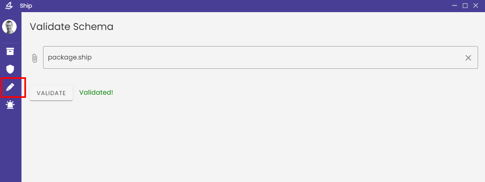
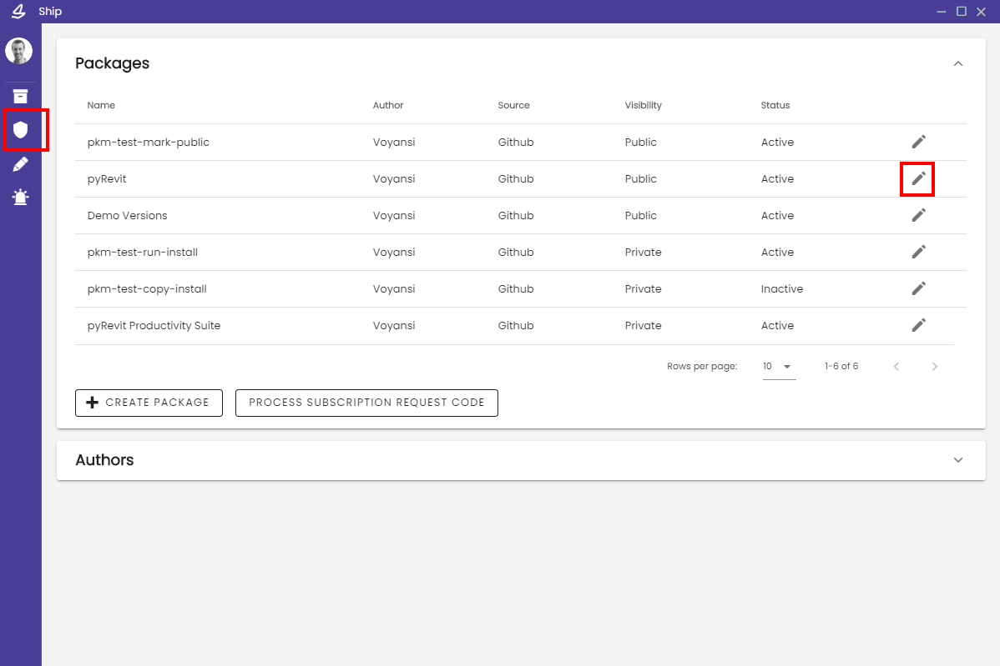
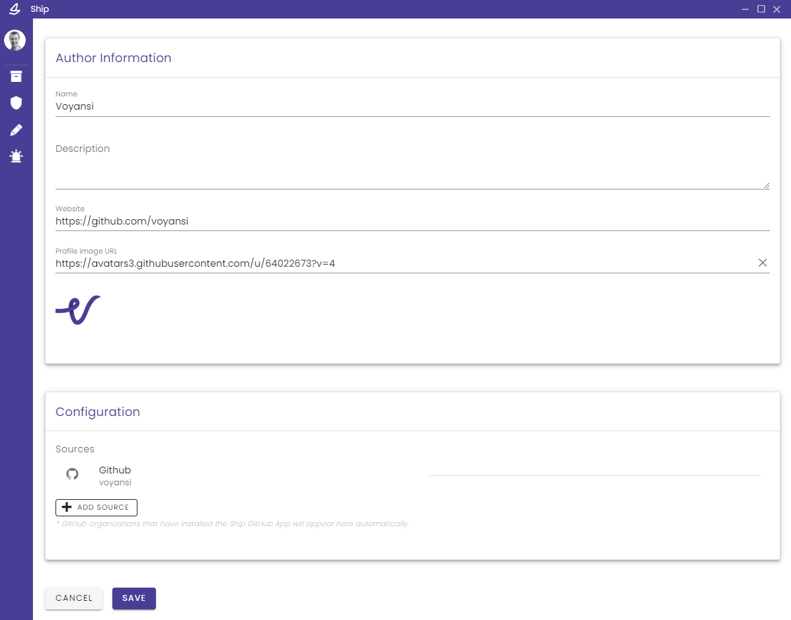

[Go to Main Page](README.md)

# Package Management

_Guide for package developers and managers_

Package Manager currently supports packages deployed and hosted through GitHub repository releases. Additional development and hosting platforms (e.g. Azure DevOps, static URL storage) may be integrated in future versions.

## Install GitHub App

1. **Install the [Package Manager GitHub App]()** (_TODO: get link_) from the App Marketplace onto either a personal GitHub account or an organization. You will be asked to accept permissions granting the app access to limited scopes for your organization.

2. **Set repository access**. Only selected repositories will be available to be published through Package Manager. You may add or remove repositories at any time (note, however, that removing a repository will delete the corresponding package from Package Manager).

   Installation settings can be found in your GitHub settings:

   - Settings > Applications > Installed GitHub Apps > Configure _(personal account)_
   - Settings > Installed GitHub Apps > Configure _(organization)_

   

## Sign In with GitHub

In order to manage and publish packages available from your selected repositories, you must sign into Package Manager using the GitHub sign-in option. You will be asked to accept some permissions requested by Package Manager the first time doing so. The packages available to you to manage will include any repositories added from that user's personal account, plus any repositories added to an organization for which the user has an `owner` role for the organization itself.

## Define Package Installation Schema

Instructions for installing and uninstalling a package must be specified in a `manage.package` asset file included in each release from a repository:


The `manage.package` file is a JSON-formatted object with defined fields and configuration options. The following is an example of a valid `manage.package` definition under schema version 1:

```
{
  "version": 1,
  "processes": [
    {
      "name": "Revit.exe"
    }
  ],
  "install": [
    {
      "action": "download-source-code",
      "source": "source_code"
    },
    {
      "action": "run",
      "source": "install-package.exe"
    },
    {
      "action": "copy",
      "source": "source_code\\content-library",
      "destination": "$APPDATA\\somePackageDirectory"
    }
  ],
  "uninstall": [
    {
      "action": "run",
      "source": "uninstall-package.exe"
    },
    {
      "action": "delete",
      "source": "$APPDATA\\somePackageDirectory"
    }
  ]
}
```

- `version`: the `manage.package` schema version number; currently there is only a schema version number 1
- `processes`: a list of applications which should be closed in order for the package to be installed; installation will be blocked until they are closed
- `install`: a list of operations to perform with the downloaded package assets; the following actions are available:

  - `download-source-code`: downloads and extracts the contents of a repository (files and directories); use the "source" property to define a name which can be used as a directory prefix for other operations. If this operation is included at all, it must be listed first
  - `run`: opens and executes a program
  - `copy`: copies a file or directory to the specified destination

- `uninstall`: a list of operations to perform to uninstall a package; the following actions are available:

  - `run`: opens and executes a program
  - `delete`: deletes a file or directory at the specified location

You may choose whichever combination of operations they deem appropriate. Operation sources with the action `run`, `copy`, or `delete` will, by default, look for a release asset matching the file name. If the "source" path is prefixed with the name specified from a `download-source-code` action source, it will look in the extracted source code files. You may also specify a fully-qualified file path, including with the use of windows environment path variables prefixed with a `$` (e.g. `$APPDATA`, `$LOCALAPPDATA`, `$TEMP`).

### Validate a schema definition

Before releasing a package, you can validate that the `manage.package` file is correctly formatted and defined using the validation feature in the Package Manager "Developer" panel:



An incorrectly-defined file will return an error with additional details.

## Create a GitHub Release

You can choose to create one or more GitHub releases for your repository, in whichever process you choose (e.g. manually, GitHub Actions, CI/CD pipelines). In the release assets, you must include the `manage.package` file, along with any other static asset files (e.g. compiled executables, .zip files) referred to in its `install` or `uninstall` operations.

Package Manager will automatically pick up on and sync with any new or deleted releases.

## Publish and Manage a Package

Repositories that were selected in your GitHub App installation configuration will appear in the "Admin" panel of Package Manager (remember to sign in with GitHub!). By default, newly-added respositories are set to `Inactive`, meaning they will not be visible to users in the "Browse" package listings.

To publish the package and make it available for others to install, edit the package from the "Admin" panel:



Inside the package editor, you will find options to change and add metadata, as well as set the package status to "Active".


- `Name`: the package display name that will be used throughout the app; this defaults to the GitHub repository name unless otherwise specified
- `Description`: describe your package features or include any miscellaneous metadata
- `Releases available`: choose which releases from the repository to make available to download via the package details panel
- `Package Dependencies`: choose which, if any, other packages are required dependencies in order to use your package; if a user tries to install your package while missing its dependencies, they will be prompted to either have the dependencies installed automatically or to ignore the warning and manage dependencies manually
- `Tags`: add helpful keywords and categories that others can use to search for and find your package
- `Website URL`: optionally link to a website with more information about your package
- `Image URLs`: add one or more images (separately hosted URL links) to illustrate your package, shown in the package Details panel; the first image will also be used as the thumbnail image throughout the app (you can drag-drop the images to rearrange them)
- `Inactive | Active`: controls the visibility of your package in the Browse listings

### Test Install / Uninstall Behavior

_Feature not yet implemented_

## Manage an Author

You can also edit metadata for authors available in your Admin panel:




- `Name`: the author name; defaults to the GitHub user or organization name
- `Description`: add information about the author or miscellaneous data
- `Website`: a website for the author; defaults to the GitHub profile URL
- `Profile Image`: a URL to a thumbnail image for the author used throughout the app; defaults to the GitHub account's profile thumbnail, if available
